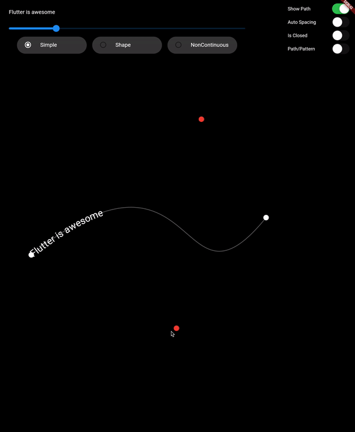
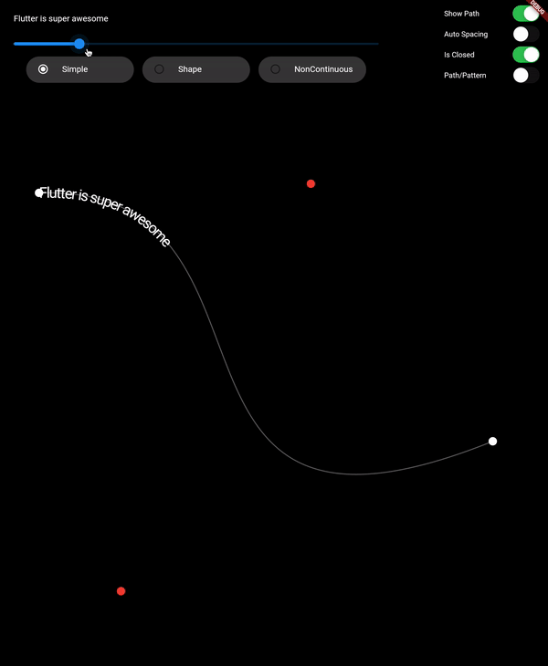
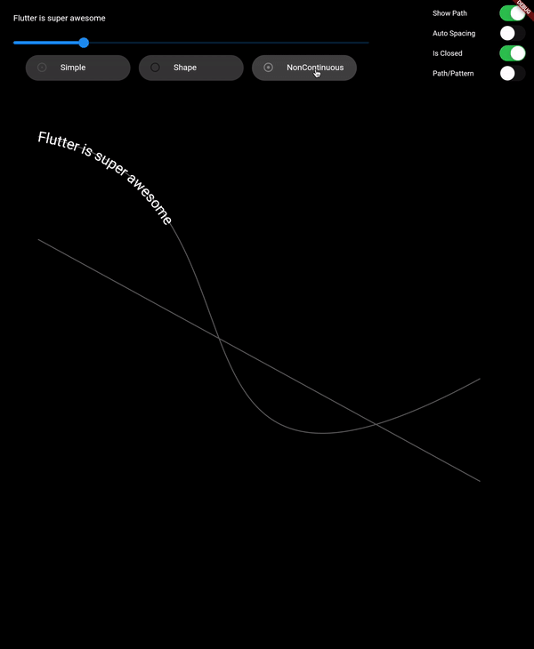
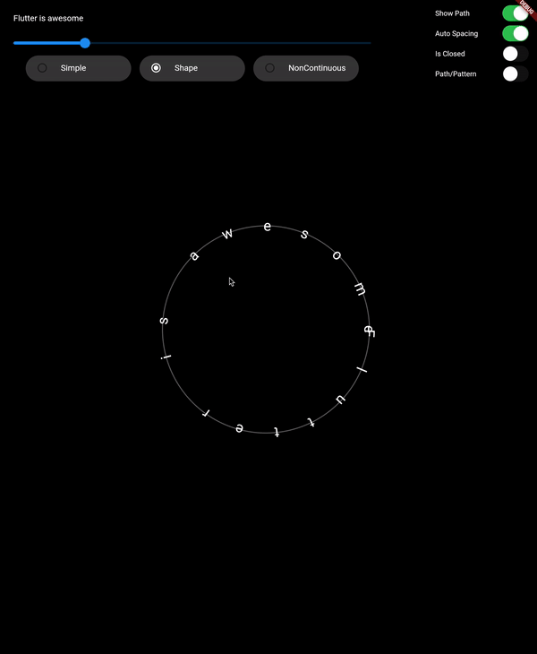
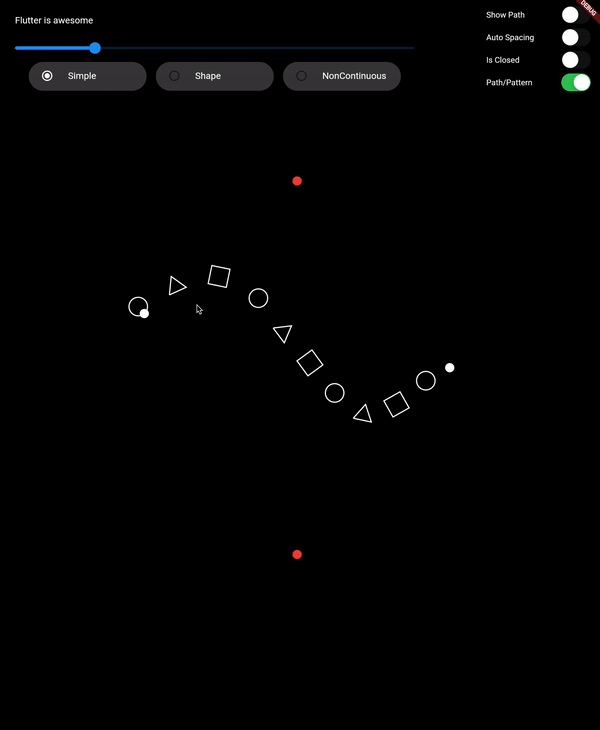
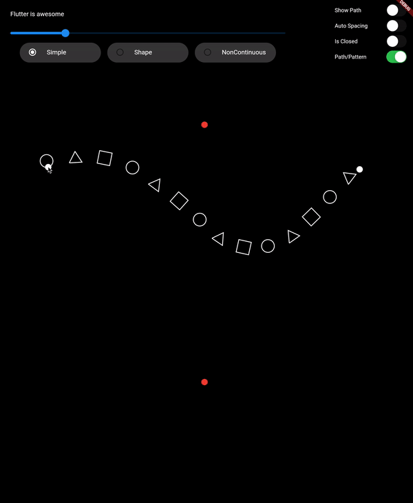

# Draw on Path

A Flutter package that is used to draw text or patterm along the given path.

## Features

- Draw text along path
- Draw pattern along path
- Support non-continuous path

## Showcase









## Usage

* `drawTextOnPath` function is used to draw `text` along `path`.

    ```dart
    canvas.drawTextOnPath(text, path);
    ```

* `drawOnPath` function is used to draw `pattern` along `path`. `index` can be used to draw different element at different position based on some logic. Use `canvas` to draw anything at `position`. The next `position` is calculated based on `spacing` provided. 

  `spacing` should be greater than 0. Ideally `spacing` is the sum of one element width and spacing between two elements (spacing between starting points of two consecutive elements)

    ```dart
    canvas.drawOnPath(
        path,
        (int index, Canvas canvas, Offset position) {
          canvas.drawRect(
            Rect.fromCircle(center: position.translate(0, -16), radius: 16),
            Paint()
              ..color = Colors.white38
              ..strokeWidth = 2.0
              ..style = PaintingStyle.stroke,
          );
        },
        spacing: 70,
      );
    ```

- **Note**: *If the `text` (for given `textStyle`) is larger than the `path`, then it will clip extra text.*

## Contributing

    1. Fork it (<https://github.com/himanshugarg08/draw_on_path/fork>)
    2. Create your feature branch (`git checkout -b feature/fooBar`)
    3. Commit your changes (`git commit -am 'Add some fooBar'`)
    4. Push to the branch (`git push origin feature/fooBar`)
    5. Create a new Pull Request